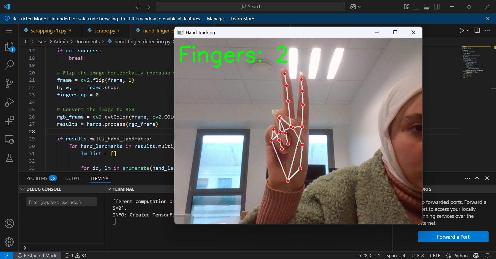

#  Hand Tracking & Finger Counting with OpenCV & MediaPipe

This project uses **OpenCV** and **MediaPipe** to detect a hand through the webcam and count the number of raised fingers in real time. The result is displayed directly on the screen, along with the hand landmarks.

##  Features

- Real-time tracking of a single hand via webcam
- Detection and display of raised fingers
- Visualization of hand landmarks and connections
- Dynamic display of the number of detected fingers

##  Technologies

- [Python 3](https://www.python.org/)
- [OpenCV](https://opencv.org/)
- [MediaPipe](https://mediapipe.dev/)

## Installation

1. Clone the repository:

```bash
git clone https://github.com/your-username/project-name.git
cd project-name

2. Install the dependencies:
   ```bash
   pip install opencv-python mediapipe

 ## Run the project
 ```bash
  python hand_finger_detection.py
 ```
Press q to close the webcam window

## Demo



